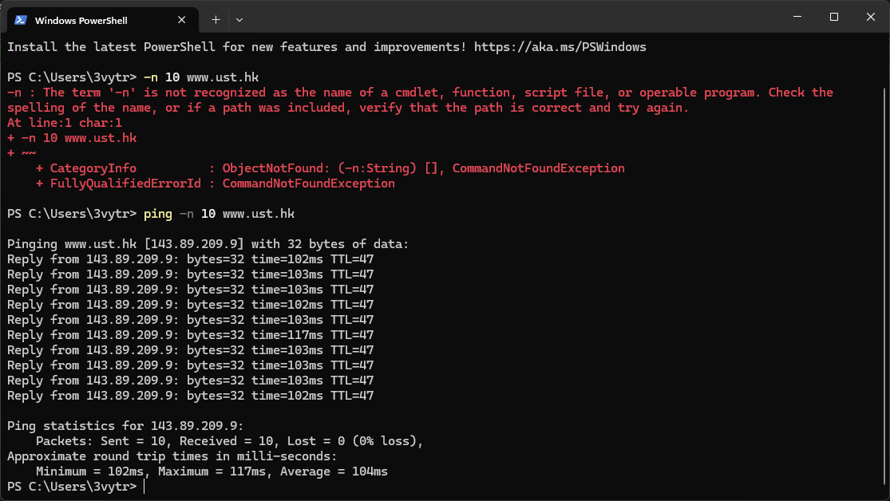
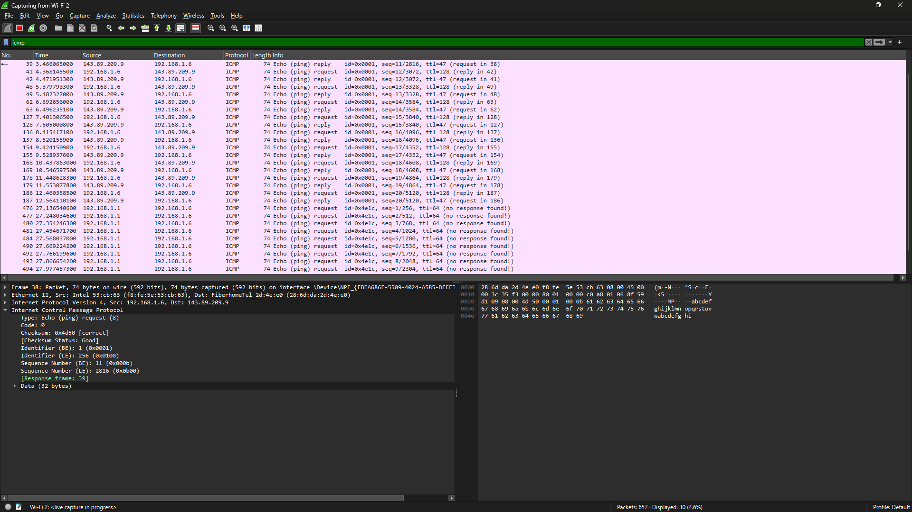

# Modul 12 – ICMP
## Yoga perkasa didik

ICMP singkatan dari Internet Control Message Protocol. ICMP adalah sebuah protokol yang digunakan oleh perangkat termasuk router dalam jaringan komputer berbasis IP untuk mengirimkan pesan-pesan kontrol dan laporan kesalahan antara perangkat jaringan. ICMP bekerja pada lapisan jaringan dalam model referensi OSI (Open Systems Interconnection).

## Praktek langsung ICMP
1. Lakukan ping ke website target dengan memberi jumlah ping (Wajib)

2. Periksa wireshark untuk melakukan observasi pada proses ping.
> sebelum itu, kita bisa memasukan keyword ``ICMP`` untuk menampilkan packet dengan jenis ICMP saja.
- 

Dapat di lihat jika setiap packet ICMP memiliki tipe pesan ICMP berupa angka 8, lalu ada sub kode (0) yang menandakan jika tidak ada kondisi kesalahan pada packet. Checksum untuk memastikan tidak ada data/byte yang hilang, identifier, dan sequence.

