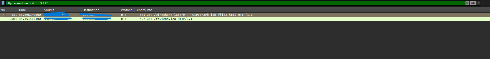
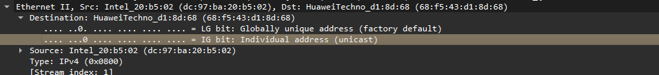

# Laporan Praktikum Jaringan Komputer (Week 2)

## Nama : Yoga Perkasa Didik
## Nim  : 103072400106

### Apa itu ARP dan Ethernet?
**ARP** (Address Resolution Protocol) adalah protokol yang digunakan untuk mencari alamat MAC (Media Access Control) dari suatu alamat IP di jaringan lokal (LAN).
Sedangkan **Ethernet** adalah teknologi jaringan yang digunakan untuk menghubungkan perangkat dalam jaringan lokal (LAN) menggunakan kabel, sehingga perangkat dapat saling bertukar data.

### 1. Mencari traffic Ethernet pada wireshark!

Ketikan ``http.request.method == "GET"`` untuk melakukan pencarian pada semua paket yang melewati protokol keamanan HTTP dengan metode pengiriman GET.

**Target** = http://gaia.cs.umass.edu/wireshark-labs/HTTP-wireshark-lab-file3.html

### 2. Lakukan pengecekan frame  pada target untuk melihat informasi Mac address dan destination.

anda dapat menemukan informasi mengenai mac address pada **Ethernet II**.

### 3. Melakukan Clearing jika ingin menghapus cache ARP agar bisa terlihat di wireshark.

Jalankan perintah ``arp -d *``

### 4. Informasi mengenai ARP Request & ARP Response
ARP request sendiri ditujukan untuk mencari MAC Address dari sebuah IP tertentu.

ARP Response mengembalikan MAC Address ke IP penerima.

ARP request dapat dilihat dari perintah Who has yang ingin meminta ip dari 192******** dan dijawab oleh bawahnya yang mengirim mac address.