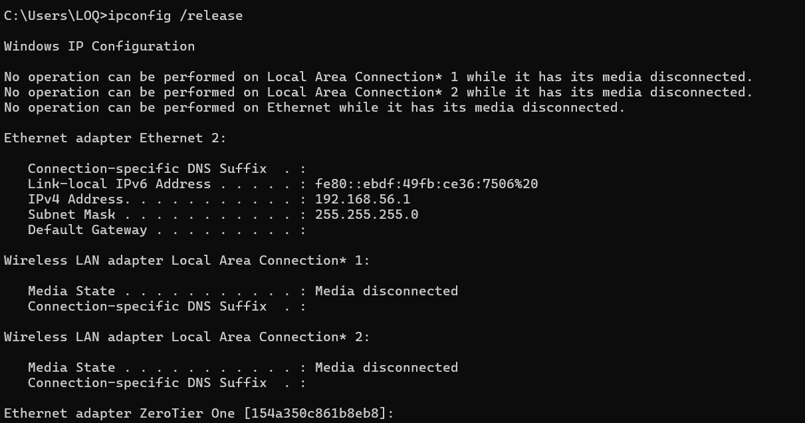
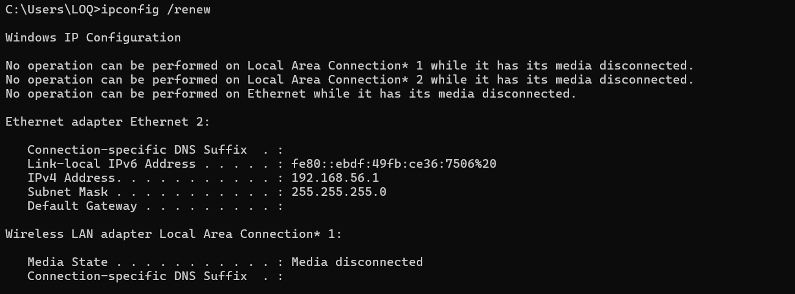
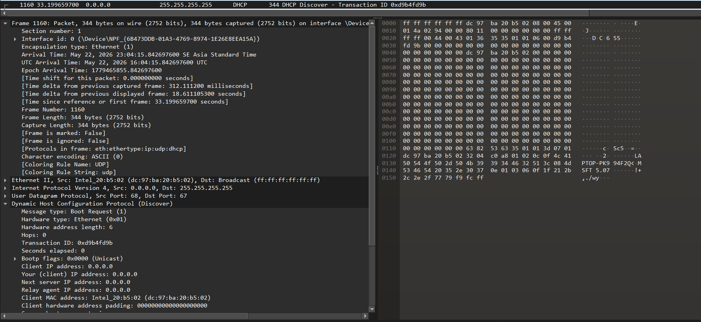

# Laporan Praktikum Jaringan Komputer (Week 6) 
# DHCP
<br/>

## Nama : Yoga Perkasa Didik
## Nim  : 103072400106
---
1. Release IP Address melalui command `ipconfig`
    masukan :
    ```cmd
        ipconfig /release
    ```


> Perintah ini bertujuan untuk melepaskan alamat IP yang sedang digunakan pada local device anda.

2. Renew IP Addres
    masukan :
    ```cmd
        ipconfig /renew
    ```


> Perintah ini bertujuan untuk membuat atau memperbarui IP address dengan cara memintal alamat IP baru ke DHCP server.

3. Mempelajari filter DHCP pada wireshark yang meliputi

    - DHCP offer
    DHCP Offer merupakan paket balasan yang berisi alamat IP kepada client yang dikirim dari DHCP server. Biasanya, informasi yang diberikan berupa Alamat IP, Subnet mask, Gateaway, Lease time.

    - DHCP request
    DHCP Request dikirim oleh client untuk meminta penggunaan alamat IP yang telah ditawarkan oleh DHCP server (untuk mengkonfirmasi pilihan alamat IP dan memberitahu server bahwa client menerima penawaran IP).

    - DHCP ACK
    DHCP ACK merupakan balasan akhir dari DHCP server yang menyatakan bahwa alamat IP telah resmi diberikan kepada client.
    