# Laporan Praktikum Jaringan Komputer (Week 2)

## Nama : Yoga Perkasa Didik
## Nim  : 103072400106

## Mencakup cara
1. [Basic HTTP GET/response interaction](#basic-http-get/response-interaction)
2. [HTTP CONDITIONAL GET/response interaction](#http-conditional-get/response-interaction)
3. [Retrieving long documents](#retrieving-long-documents)
4. [HTML Documents dengan embedded object](#html-documents-dengan-embedded-object)
5. [HTTP Authentication](#http-authentication)

# Basic HTTP GET/response Interaction
> Praktikum kali ini membahas bagaimana server web menerima HTTP request dari pengguna, memprosesnya, lalu mengirimkan HTTP response kembali ke browser.
> Target : http://gaia.cs.umass.edu/wireshark-labs/HTTP-wireshark-file1.html

1. Hapus cache pada target
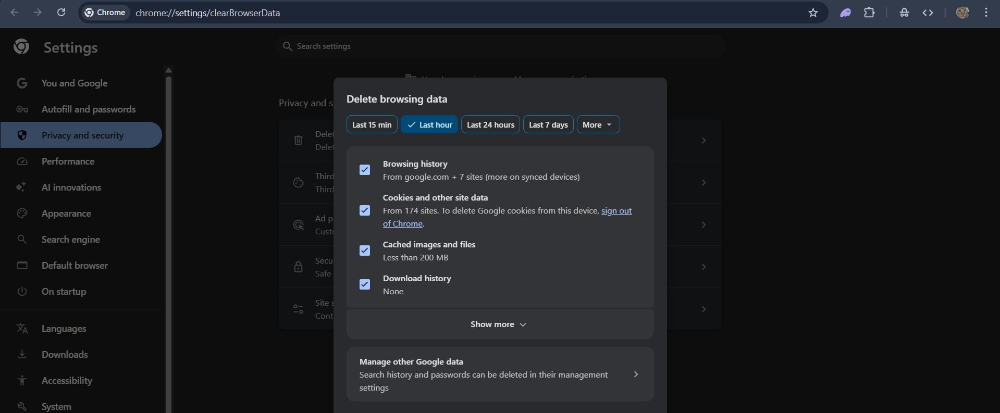
> Hal ini ditujukan agar website dapat mengirimkan request tersebut, kalau tidak di hapus maka browser tidak perlu mengirimkan ulang request karena sudah disimpan di cache.

2. Refresh website dan buka wireshark
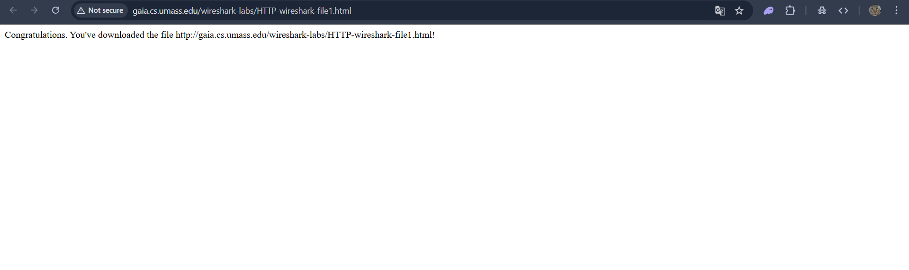

3. Masuk ke wireshark -> Pilih Wifi -> Ketik HTTP
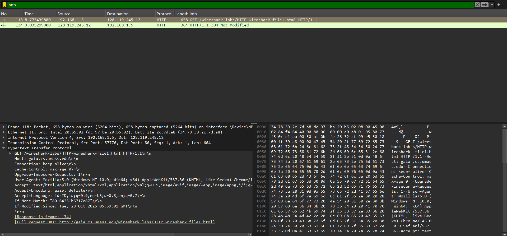
> Jika berhasil maka akan langsung tertangkap packet yang dikirimkan oleh browser.

# HTTP CONDITIONAL GET/response interaction
> Kalau tadi meminta request tanpa menggunakan bantuan cache, sekarang saya akan melakukan pemanggilan request dengan bantuan cache. 

1. Matikan Cache melalui ctrl + shift + del
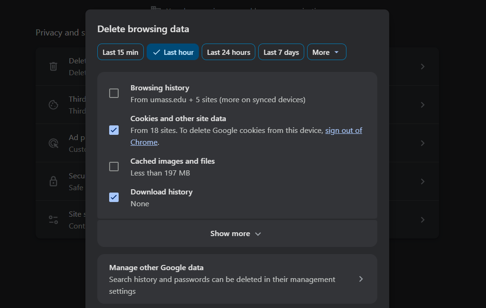
> Ini ngebuat hasil request kita disimpan di cache, jadi next pemanggilan tidak perlu repot repot meminta ulang ke server.

2. Periksa apakah terdapat if-modified-since pada Hypertext Transfer Protocol (wireshark)
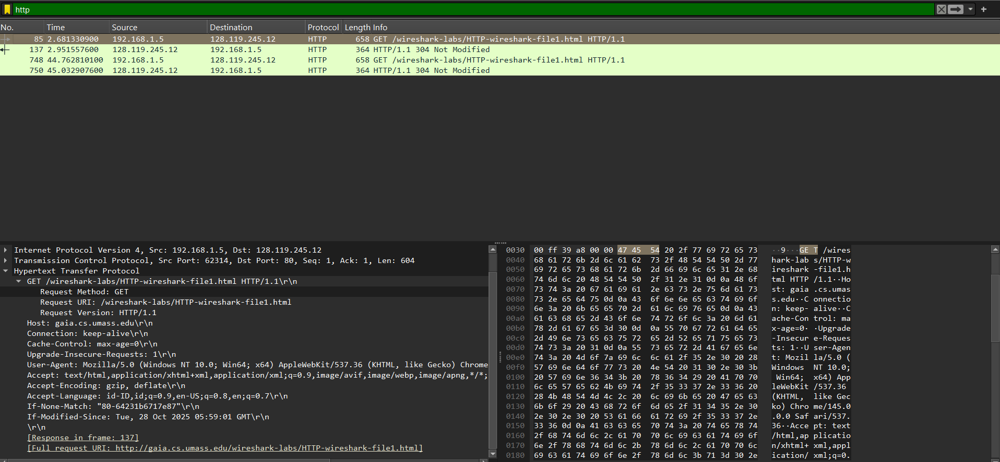
> Dapat dilihat jika If-modified-since menunjuk tanggal terakhir dari file dimodifikasi. Ini sama aja kayak kapan komputer kita menyimpan file ini menjadi cache.
>Selain itu, server mengirimkan kode status HTTP untuk menunjukkan hasil dari request yang dilakukan. Jika browser menggunakan cache dan file di server tidak mengalami perubahan, maka server akan mengirimkan kode 304 Not Modified, sehingga browser dapat menggunakan data yang tersimpan di cache. Sedangkan jika request dilakukan tanpa menggunakan cache atau file telah mengalami perubahan, server akan mengirimkan kode 200 OK dan mengirimkan kembali data yang diminta oleh browser.
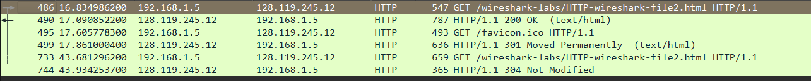

# Retrieving long documents
> Mengamati bagaimana data yang besar tidak cukup jika dikirim dengan satu paket TCP yang nantinya akan dibagi menjadi beberapa segmen TCP.

1. Pastikan Cache terhapus lalu buka https://gaia.cs.umass.edu/wireshark-labs/HTTP-wireshark-file3.html
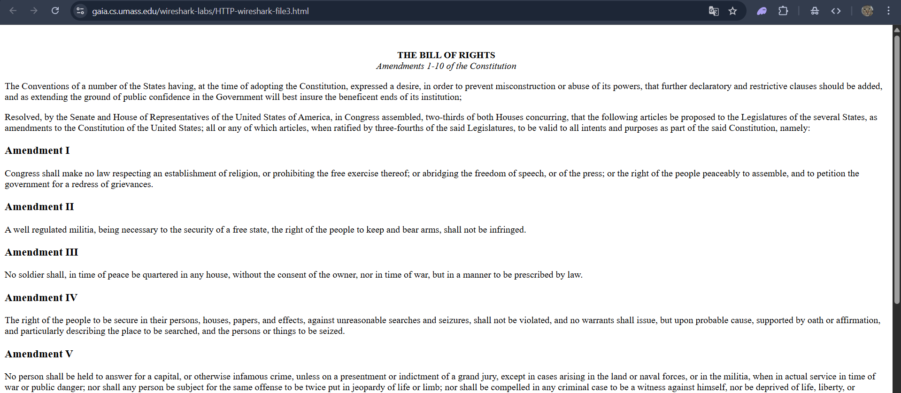

2. Masuk ke dalam wireshark
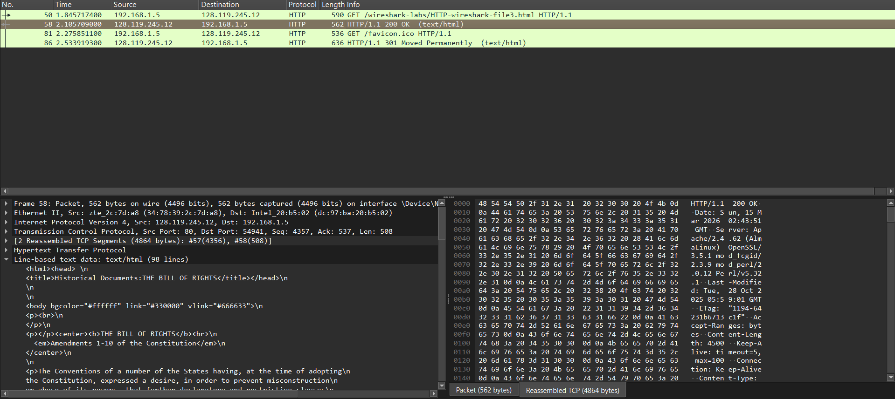
> Tulisan reassembled dikanan menandakan jika semua segmen telah digabung.

# HTML Documents dengan embedded object
> Mengamati bagaimana embedded object seperti gambar dapat mempengaruhi permintaan request browser.

1. Masuk ke web target dan refresh. Target = http://gaia.cs.umass.edu/wireshark-labs/HTTP-wireshark-file4.html
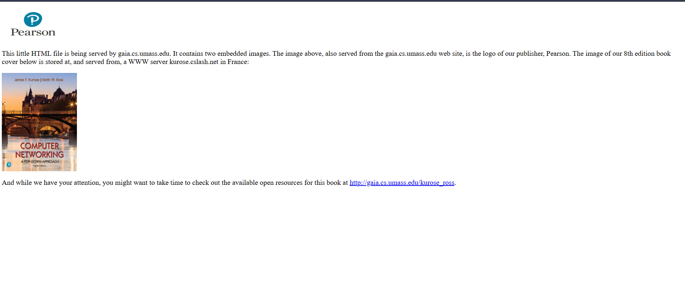

2. Masuk ke dalam wireshark 
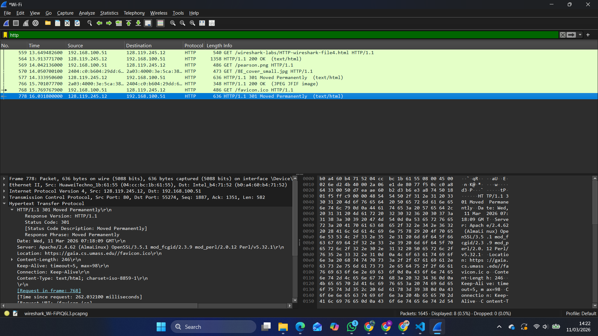
> Dapat dilihat jika gambar meminta request tambahan karena gambar tersebut tidak terdapat di file html yang mengharuskan browser melakukan pengunduhan manual.

# HTTP Authentication
> Menjelaskan mengenai proses autentikasi pada http serta melihat bagaimana password dikirim melalui jaringan.

1. Masuk ke website target dan lakukan refresh. Target = https://gaia.cs.umass.edu/wireshark-labs/protected_pages/HTTP-wireshark-file5.html
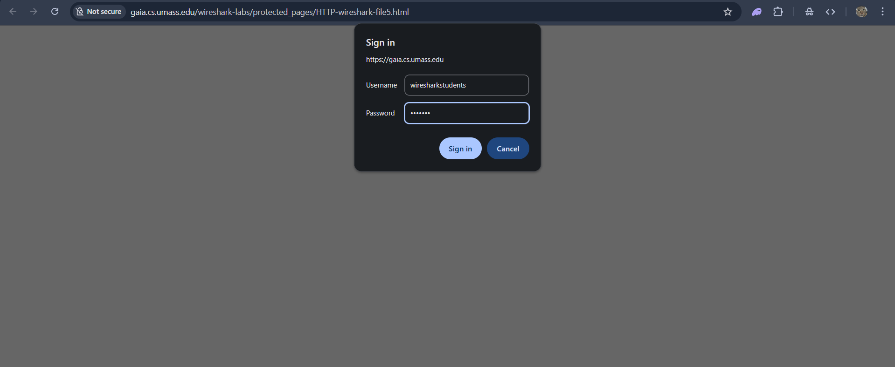
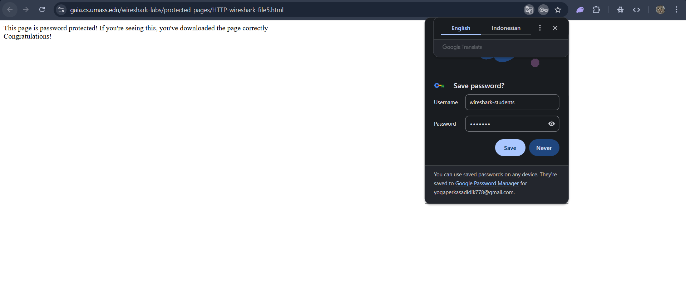

2. Masuk ke wireshark
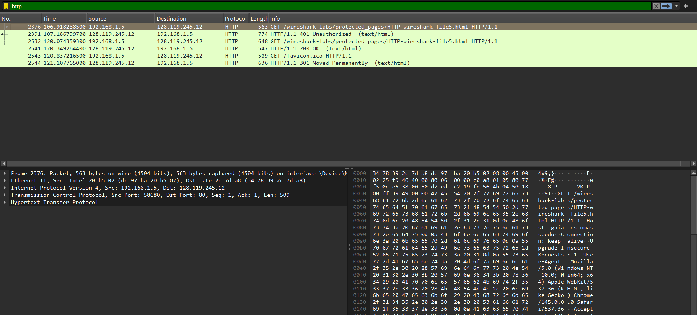
> Berdasarkan hasil pengamatan, ketika pengguna pertama kali mengakses website tersebut, server akan mengirimkan respons 401 Unauthorized sebagai permintaan autentikasi kepada browser. Setelah itu, browser akan mengirim kembali permintaan HTTP request yang berisi username dan password dalam bentuk string pada header Authorization: Basic. Username dan password tersebut tidak dienkripsi, melainkan hanya dikodekan menggunakan format Base64. Oleh karena itu, informasi login tersebut masih dapat diterjemahkan kembali ke bentuk teks asli sehingga dapat terlihat pada hasil tangkapan paket menggunakan Wireshark. Hal ini menunjukkan bahwa penggunaan autentikasi dasar pada HTTP kurang aman karena data sensitif seperti username dan password dapat dengan mudah dibaca oleh pihak yang berhasil menangkap paket jaringan.
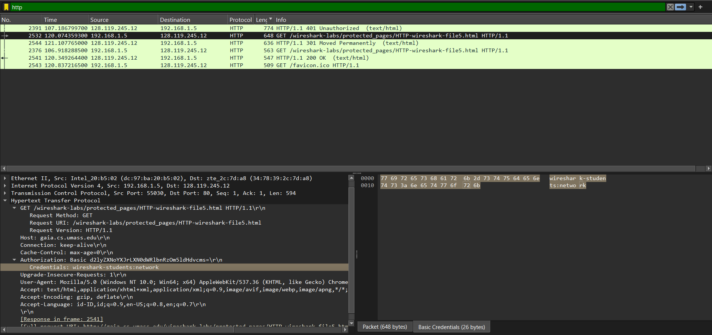