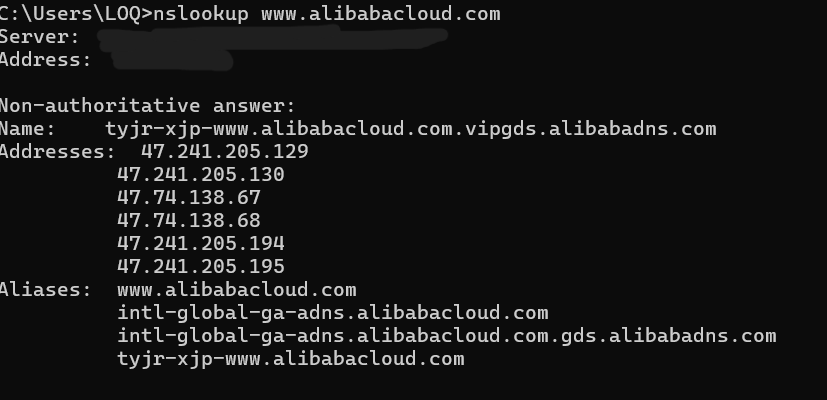
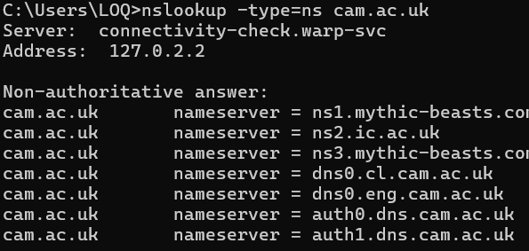
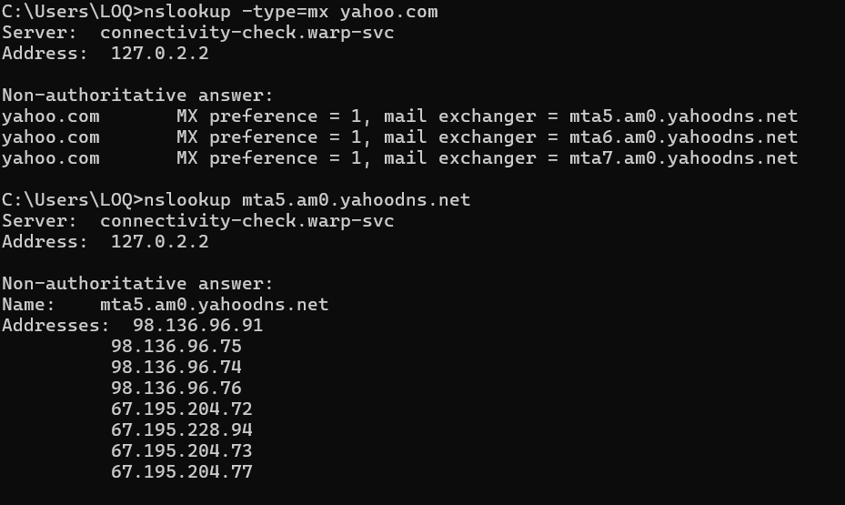
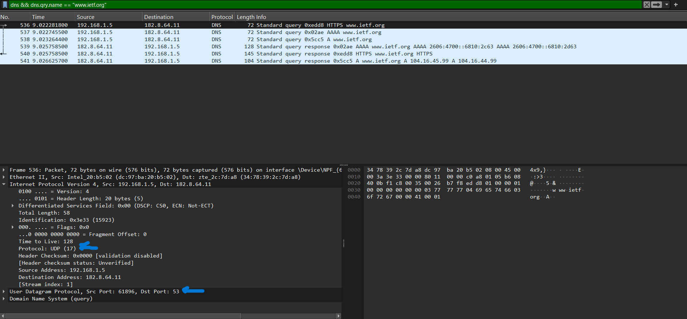
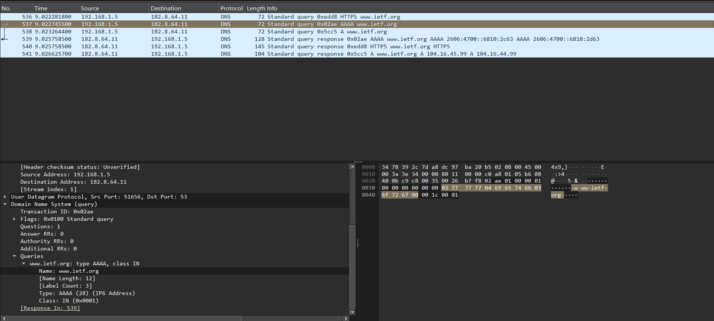
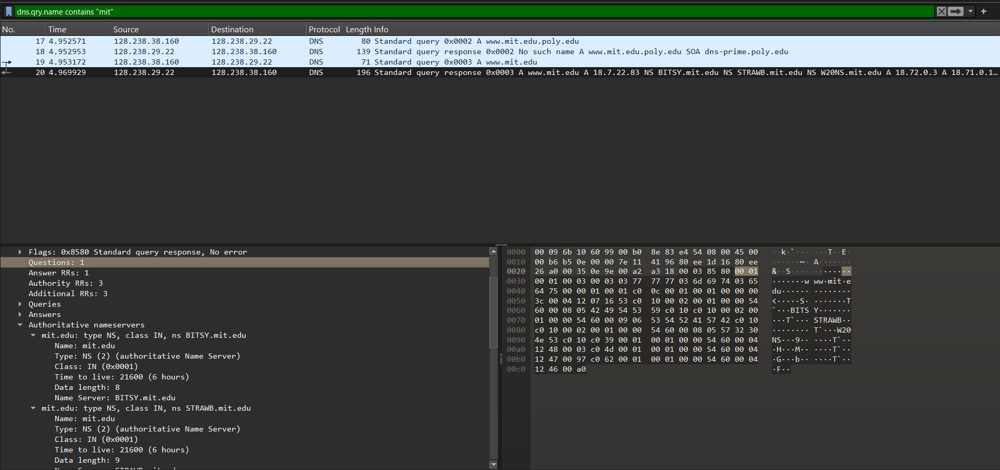
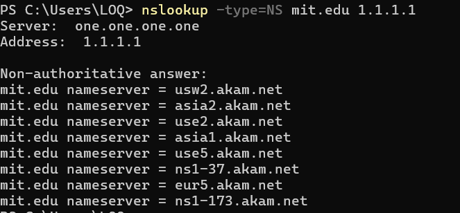
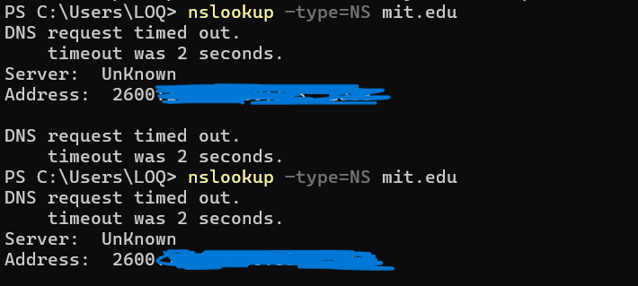
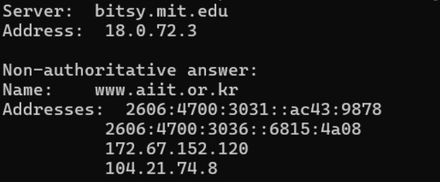

# Laporan Praktikum Jaringan Komputer (Week 4) 
# DNS
 

## Nama : Yoga Perkasa Didik
## Nim  : 103072400106
---

## Section Soal Pertama (IPconfig)
## (1)
1. Jalankan nslookup untuk mendapatkan alamat IP dari server web di Asia. Berapa alamat IP
server tersebut? 
2. Jalankan nslookup agar dapat mengetahui server DNS otoritatif untuk universitas di Eropa.
3. Jalankan nslookup untuk mencari tahu informasi mengenai server email dari Yahoo! Mail
melalui salah satu server yang didapatkan di pertanyaan nomor 2. Apa alamat IP-nya?

## Jawaban
1. Target = www.alibabacloud.com
- Ip Asia = 47.241.205.130

2. Target = cam.ac.uk, code = nslookup -type=ns cam.ac.uk
- List server DNS Authoritative 
cam.ac.uk       nameserver = ns1.mythic-beasts.com
cam.ac.uk       nameserver = ns2.ic.ac.uk
cam.ac.uk       nameserver = ns3.mythic-beasts.com
cam.ac.uk       nameserver = dns0.cl.cam.ac.uk
cam.ac.uk       nameserver = dns0.eng.cam.ac.uk
cam.ac.uk       nameserver = auth0.dns.cam.ac.uk
cam.ac.uk       nameserver = auth1.dns.cam.ac.uk

3. Alamat IP server email yahoo
- Server email yahoo = mta5.am0.yahoodns.net
- hasil = 98.136.96.91
- 

---

# Tracing DNS dengan Wireshark
## (2)
1. Cari pesan permintaan DNS dan balasannya. Apakah pesan tersebut dikirimkan melalui UDP
atau TCP?
2. Apa port tujuan pada pesan permintaan DNS? Apa port sumber pada pesan balasannya?
3. Pada pesan permintaan DNS, apa alamat IP tujuannya? Apa alamat IP server DNS lokal anda
(gunakan ipconfig untuk mencari tahu)? Apakah kedua alamat IP tersebut sama?
4. Periksa pesan permintaan DNS. Apa “jenis” atau ”type” dari pesan tersebut? Apakah pesan
permintaan tersebut mengandung ”jawaban” atau ”answers”?
5. Periksa pesan balasan DNS. Berapa banyak ”jawaban” atau ”answers” yang terdapat di
dalamnya? Apa saja isi yang terkandung dalam setiap jawaban tersebut?
6. Perhatikan paket TCP SYN yang selanjutnya dikirimkan oleh host Anda. Apakah alamat IP
pada paket tersebut sesuai dengan alamat IP yang tertera pada pesan balasan DNS?
7. Halaman web yang sebelumnya anda akses (http://www.ietf.org) memuat beberapa
gambar. Apakah host Anda perlu mengirimkan pesan permintaan DNS baru setiap kali ingin
mengakses suatu gambar?

## Jawaban
1. Protokol yang digunakan adalah **UDP**

2. Port
- Destination Port (Request) = 53
- Source Port = 51656
- Source Port (Response) = 53

3. Sama, Destination address dari request sama dengan DNS server di ipconfig.

4. Type = A
- Tidak ada Answer pada request

5. 2 Answer
- Isi yang terkandung pada answer berupa domain, Type, Address, Time to live, class, dan data length

6. Sama
- Answer

- Syn

7. Tidak ada permintaan DNS baru karena hasil DNS disimpan berupa Cache. Permintaan DNS baru akan dilakukan jika user menonaktifkan cache otomatis pada browser, atau ketika cache sudah expired.

---

## (3)
1. Apa port tujuan pada pesan permintaan DNS? Apa port sumber pada pesan balasan DNS?
2. Ke alamat IP manakah pesan permintaan DNS dikirimkan? Apakah alamat IP tersebut
merupakan default alamat IP server DNS lokal Anda?
3. Periksa pesan permintaan DNS. Apa ”jenis” atau ”type” dari pesan tersebut? Apakah pesan
tersebut mengandung ”jawaban” atau ”answers”?
4. Periksa pesan balasan DNS. Berapa banyak ”jawaban” atau “answers” yang terdapat di
dalamnya. Apa saja isi yang terkandung dalam setiap jawaban tersebut?
5. Sertakan hasil tangkapan layar

## Jawaban
1. Port Tujuan = **53** & Port Sumber = **53**
- Port Tujuan (Request)

- Port Sumber (Response)

2. Ya, alamat IP yang digunakan adalah IP server DNS lokal yang dipakai oleh Host saat melakukan packet capture.
- Tujuan = 128.238.29.22
- Sumber = 128.238.38.160

3. Type = A
- Pesan tidak mengandung Answer, hanya question.

4. Jumlah answer = 1
- Isi pada answer mengandung type, class, time to live, data length, dan nama server

---

## (4)
1. Ke alamat IP manakah pesan permintaan DNS dikirimkan? Apakah alamat IP tersebut
merupakan default alamat IP server DNS lokal Anda?
2. Periksa pesan permintaan DNS. Apa ”jenis” atau ”type” dari pesan tersebut? Apakah pesan
tersebut mengandung ”jawaban” atau ”answers”?
3. Periksa pesan balasan DNS. Apa nama server MIT yang diberikan oleh pesan balasan?
Apakah pesan balasan ini juga memberikan alamat IP untuk server MIT tersebut?
JARINGAN KOMPUTER 29
4. Sertakan hasil tangkapan layar.

## Jawaban
1. Request dikirim ke non default DNS server **(one.one.one.one)** karena perintah bawaan modul tidak bisa di run kecuali saya mengaktifkan DNS manual seperti cloudflare.
- IP DNS = 1.1.1.1
- Apakah alamat IP server DNS lokal ? = **Tidak**, karena host harus memilih sendiri server DNS yang digunakan.

2. Jenis = NS 
- Pesan mengandung answer

3. Nama nama server diberikan, namun tidak dengan IP.

- Tanpa menggunakan DNS pilihan

---

## (5)
1. Ke alamat IP manakah pesan permintaan DNS dikirimkan? Apakah alamat IP tersebut
merupakan default alamat IP server DNS lokal Anda?
2. Periksa pesan permintaan DNS. Apa ”jenis” atau ”type” dari pesan tersebut? Apakah pesan
tersebut mengandung ”jawaban” atau ”answers”?
3. Periksa pesan balasan DNS. Berapa banyak ”jawaban” atau “answers” yang terdapat di
dalamnya. Apa saja isi yang terkandung dalam setiap jawaban tersebut?
4. Sertakan hasil tangkapan layar.

## Jawaban
1. Tujuan = bitsy.mit.edu
- Bukan, karena 18.0.72.3 adalah ip publik milik MIT.

2. Type = A
- Request mengandung **Answer**

3. Jawaban mengandung 2 address IPV6 dan 2 address IPV4
