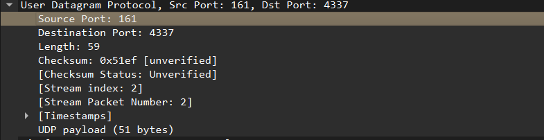
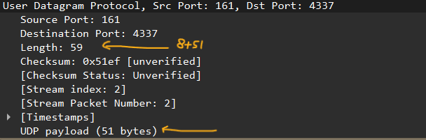
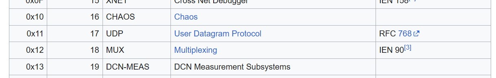

# Laporan Praktikum Jaringan Komputer (Week 4) 
# UDP
 

## Nama : Yoga Perkasa Didik
## Nim  : 103072400106
---

1. Pilih satu paket UDP yang terdapat pada trace Anda. Dari paket tersebut, berapa banyak
“field” yang terdapat pada header UDP? Sebutkan nama-nama field yang Anda temukan!
2. Perhatikan informasi “content field” pada paket yang Anda pilih di pertanyaan 1. Berapa
panjang (dalam satuan byte) masing-masing “field” yang terdapat pada header UDP?
3. Nilai yang tertera pada ”Length” menyatakan nilai apa? Verfikasi jawaban Anda melalui
paket UDP pada trace.
4. Berapa jumlah maksimum byte yang dapat disertakan dalam payload UDP? (Petunjuk:
jawaban untuk pertanyaan ini dapat ditentukan dari jawaban Anda untuk pertanyaan 2)
5. Berapa nomor port terbesar yang dapat menjadi port sumber? (Petunjuk: lihat petunjuk
pada pertanyaan 4)
6. Berapa nomor protokol untuk UDP? Berikan jawaban Anda dalam notasi heksadesimal dan
desimal. Untuk menjawab pertanyaan ini, Anda harus melihat ke bagian ”Protocol” pada
datagram IP yang mengandung segmen UDP.
7. Periksa pasangan paket UDP di mana host Anda mengirimkan paket UDP pertama dan paket
UDP kedua merupakan balasan dari paket UDP yang pertama. (Petunjuk: agar paket kedua
merupakan balasan dari paket pertama, pengirim paket pertama harus menjadi tujuan dari
paket kedua). Jelaskan hubungan antara nomor port pada kedua paket tersebut!

## Jawaban
>> Target = http-ethereal-trace-5

1.  Terdapat 4 field pada UDP
- Source Port
- Destination Port
- Length
- Checksum

2. Panjang dari setiap field header UDP adalah **16 bit** atau **2 Byte**. Karena ada 4 field pada User Diagram Protocol, maka total panjang adalah **8 Byte**.

3. Nilai pada length menyatakan jumlah data gabungan antara header dan payload.
- Header tadi kan punya nilai **8** (Fix)
- Sedangkan payload ada 51 (Dicek melalui wireshark)
- 51 + 8 = 59

4. Karena UDP mengikuti ukuran IPV4 yang 16 bits (65,535 bytes) maka maksimum dari udp adalah **65.507** karena harus dikurangi oleh IP Header (20 Bytes, minimum) dan Header UDP (8 Bytes). 65.535 - 20 - 8 = 65.507 .

5. Yang paling besar itu **65.535** karena source port punya range dari 0 - 65.535.

6. Udp memiliki nomer protokol **17** dengan heksadesimal **0x11**

7. **Request** Source Port = 4336, Dest Port = 161
- **Response** Source Port = 161, Dest Port = 4336
- Hubungan yang terjadi pada kedua port diatas adalah Komunikasi yang dilakukan oleh port **4336** untuk meminta sebuah data dari server SNMP **161**. Port SNMP lalu mengembalikan balasan ke port 4336. Port SNMP hanya perlu membalik source tanpa harus membuat header baru.