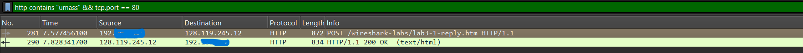
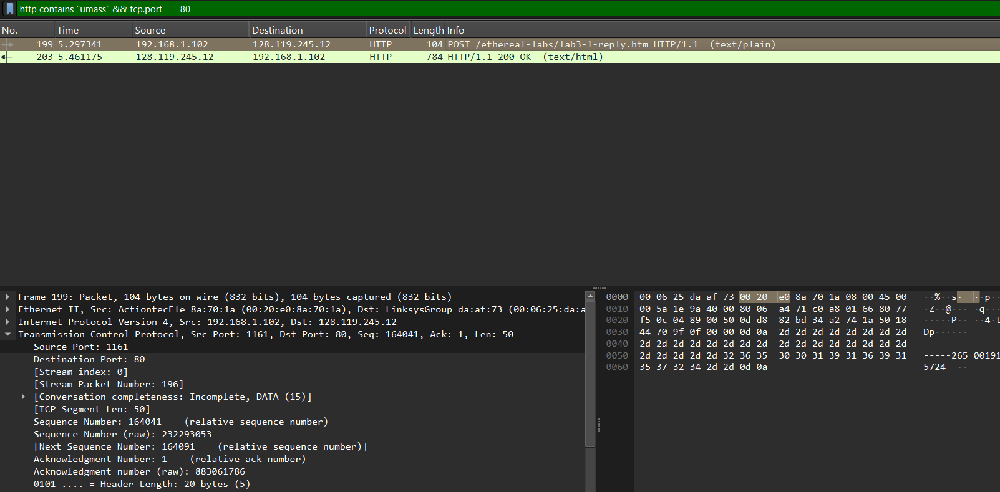
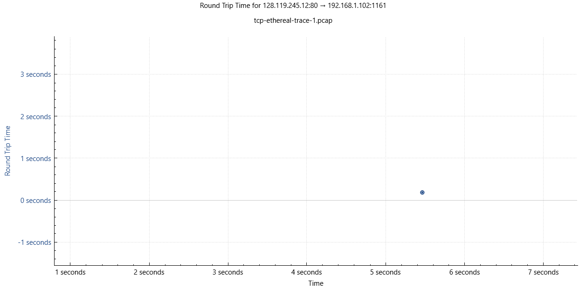
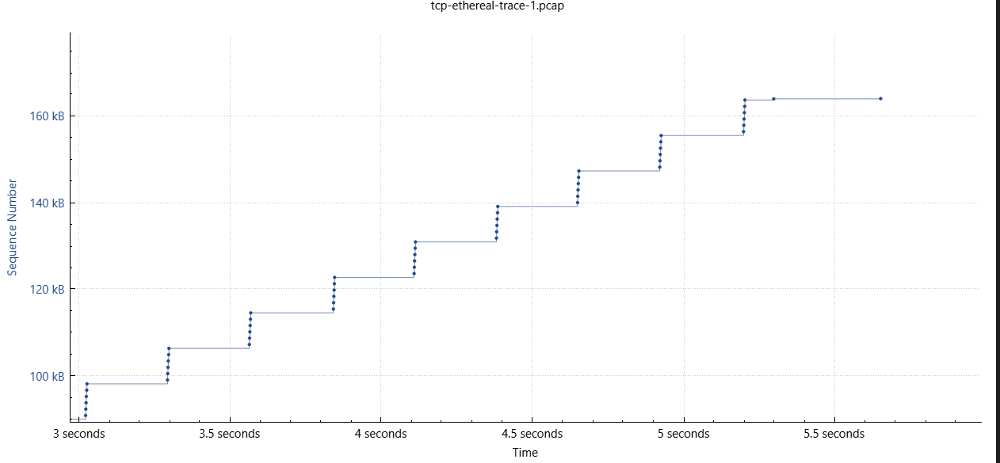
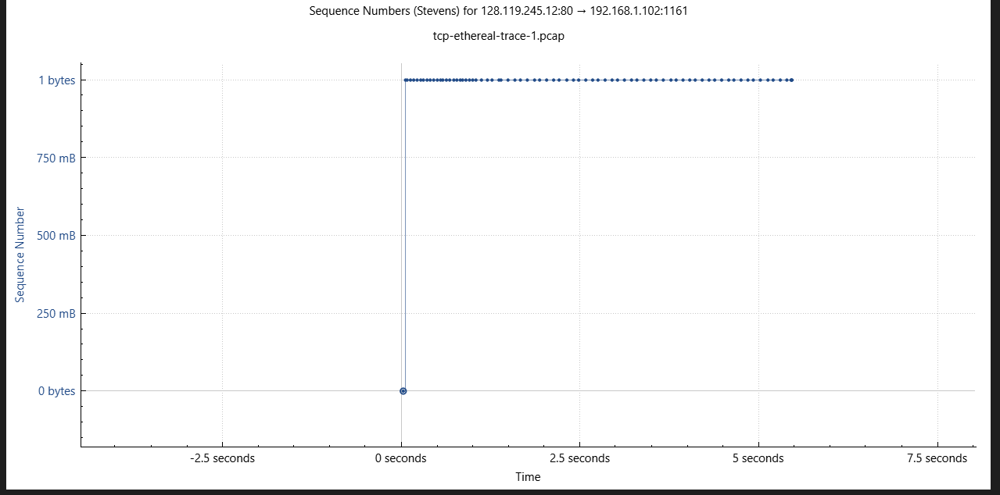

# Laporan Praktikum Jaringan Komputer (Week 4) 
# DNS
 

## Nama : Yoga Perkasa Didik
## Nim  : 103072400106
---

## Section Pertama
### Target = tcp- ethereal-trace-1 & Trace manual dari saya
1. Berapa alamat IP dan nomor port TCP yang digunakan oleh komputer klien (sumber) untuk
mentransfer file ke gaia.cs.umass.edu? Cara paling mudah menjawab pertanyaan ini adalah
dengan memilih sebuah pesan HTTP dan meneliti detail paket TCP yang digunakan untuk
membawa pesan HTTP tersebut.
2. Apa alamat IP dari gaia.cs.umass.edu? Pada nomor port berapa ia mengirim dan menerima
segmen TCP untuk koneksi ini?
### Jika Anda telah membuat trace Anda sendiri, jawab pertanyaan berikut:
3. Berapa alamat IP dan nomor port TCP yang digunakan oleh komputer klien Anda (sumber)
untuk mentransfer ke gaia.cs.umass.edu?

---
## Jawab
1. Alamat IP dan Nomer port TCP dari sang pengirim 
IP = 192.168.1.102
Port Number = 1161

2. Alamat IP dari Umass untuk mengirim dan menerima
- IP = 128.119.245.12
- Port Number = 80

3. Alamat IP dan Port number saya
- IP = 192.16******
- Port = 53955
- 
- 

---
## Section Kedua
1. Berapa nomor urut segmen TCP SYN yang digunakan untuk memulai sambungan TCP antara
komputer klien dan gaia.cs.umass.edu? Apa yang dimiliki segmen tersebut sehingga
teridentifikasi sebagai segmen SYN?
2. Berapa nomor urut segmen SYNACK yang dikirim oleh gaia.cs.umass.edu ke komputer klien
sebagai balasan dari SYN? Berapa nilai dari field Acknowledgement pada segmen SYNACK?
Bagaimana gaia.cs.umass.edu menentukan nilai tersebut? Apa yang dimiliki oleh segmen
sehingga teridentifikasi sebagai segmen SYNACK?
3. Berapa nomor urut segmen TCP yang berisi perintah HTTP POST? Perhatikan bahwa untuk
menemukan perintah POST, Anda harus menelusuri content field milik paket di bagian
bawah jendela Wireshark, kemudian cari segmen yang berisi "POST" di bagian field DATAnya.
4. Anggap segmen TCP yang berisi HTTP POST sebagai segmen pertama dalam koneksi TCP.
Berapa nomor urut dari enam segmen pertama dalam TCP (termasuk segmen yang berisi
HTTP POST)? Pada jam berapa setiap segmen dikirim? Kapan ACK untuk setiap segmen
diterima? Dengan adanya perbedaan antara kapan setiap segmen TCP dikirim dan kapan
acknowledgement-nya diterima, berapakah nilai RTT untuk keenam segmen tersebut?
Berapa nilai Estimated RTT setelah penerimaan setiap ACK? (Catatan: Wireshark memiliki
fitur yang memungkinkan Anda untuk memplot RTT untuk setiap segmen TCP yang dikirim.
Pilih segmen TCP yang dikirim dari klien ke server gaia.cs.umass.edu pada jendela
"paket yang ditangkap". Kemudian pilih: Statistics->TCP Stream Graph- >Round Trip Time
Graph).
5. Berapa panjang setiap enam segmen TCP pertama?
6. Berapa jumlah minimum ruang buffer tersedia yang disarankan kepada penerima dan
diterima untuk seluruh trace? Apakah kurangnya ruang buffer penerima pernah
menghambat pengiriman?
7. Apakah ada segmen yang ditransmisikan ulang dalam file trace? Apa yang anda periksa (di
dalam file trace) untuk menjawab pertanyaan ini?
8. Berapa banyak data yang biasanya diakui oleh penerima dalam ACK? Dapatkah anda
mengidentifikasi kasus-kasus di mana penerima melakukan ACK untuk setiap segmen yang
diterima?
9. Berapa throughput (byte yang ditransfer per satuan waktu) untuk sambungan TCP?
Jelaskan bagaimana Anda menghitung nilai ini.

## Jawab
1. **Nomer Urut Segmen TCP SYN (CLIENT)**
- Sequence Number = **0**
- Segmen tersebut teridentifikasi sebagai SYN karena terdapat flag SYN heksadesimal 0x002. 

2. **Nomer Urut Segmen TCP SYN (UMASS)**
- Sequence Number = **0**
- Nilai field acknowledgement = **1**
- Penentuan nilai dilakukan dengan cara menambah angka di sequence number dengan 1. 0 + 1 = 1.
- Segmen memiliki gelar SYN-ACK karena memiliki acknowledgement = 1 dan SYN yang juga 1. Oleh karena itu flag meng-identifikasinya sebagai SYN-ACK.

3. **Nomer Urut Segmen TCP SYN (POST)**
- Sequence Number = **164041**

4. **A. Nomer Urut 6 Segmen TCP**
> 199- merupakan nomer urut segmen pada wireshark!.
> Jam segmen dikirim mungkin itu jam segmen ditangkap? berarti Time.

  1. Segmen Pertama (HTTP POST, Nomer urut **199**)
    - Time : 5.297341 detik
    - Sequence Number : 164041
    - ACK berikutnya diterima di : **202** (164041 + 50(len) = 164091) pada **5.455830 detik**
  2. Segmen Kedua (Nomer urut **200**)
    - Time : 5.389471
    - Sequence Number : 1
    - ACK : 162309
  3. Segmen Ketiga (Nomer urut **201**)
    - Time : 5.447887
    - Sequence Number : 1
    - ACK : 164041
  4. Segmen Keempat (Nomer urut **202**)
    - Time : 5.455830
    - Sequence Number : 1
    - ACK : 164091
    - RTT setelah menerima ACK : 5.455830 - 5.297341 = 0,158489 Detik
  5. Segmen Kelima (HTTP, Nomer urut **203**)
    - Time : 5.461175
    - Sequence Number : 1
    - ACK : 164091
  6. Segmen Keenam (Nomer urut **206**)
    - Time : 5.651141
    - Sequence Number : 164091
    - ACK : 791

> RTT untuk keenam segmen adalah 0,1 Detik.

---

## Section ketiga
1. Gunakan alat plotting Time-Sequence-Graph (Stevens) untuk melihat grafik nomor urut
berbanding waktu dari segmen yang dikirim oleh klien ke server gaia.cs.umass.edu.
Dapatkah Anda mengidentifikasi di mana fase “slow start” TCP dimulai dan berakhir, dan
pada bagian mana algoritma ”congestion avoidance” mengambil alih? Berikan komentar
tentang bagaimana data yang diukur berbeda dari perilaku ideal TCP yang telah kita pelajari.
2. Jawablah kedua pertanyaan di atas untuk trace yang Anda dapatkan ketika Anda
mengirimkan file dari komputer ke gaia.cs.umass.edu.

## Jawab

> Note : untuk melihat grafik yang dikirim oleh klien ke server gaia.cs.umass.edu.
- 

1. Fase **slow start** sendiri terjadi pada awal-awal graf dimulai karena TCP sedang melakukan pengecekan untuk mengetahui kapasitas jaringan, mulai dari bandwidth dan traffic jaringan. Dia juga dapat diidentifikasi dengan pergerakan yang lambat namun naik dengan sangat cepat.
- 
- Fase **Congestion Avoidance** biasanya terjadi setelah fase slow start dimana TCP sudah mengetahui kapasitas jaringan dan mulai untuk meningkatkan sequence number untuk mencegah kemacetan pada jaringan. Congestion dapat di identifikasi pada titik yang sudah saya tandai, dapat dilihat jika kenaikan sequence cenderung stabil dan tidak tergesa-gesa seperti slow start.
- 

> Note : untuk melihat grafik yang dikirim oleh server gaia.cs.umass.edu. ke klien
- 

2. Fase **slow start** terlihat pada titik yang saya beri. Spike yang terjadi sangat cepat dan berakhir stabil menandakan jika TCP sudah mengetahui kapasitas jaringan dan mulai masuk ke tahap **Congestion Avoidance**.
- 
