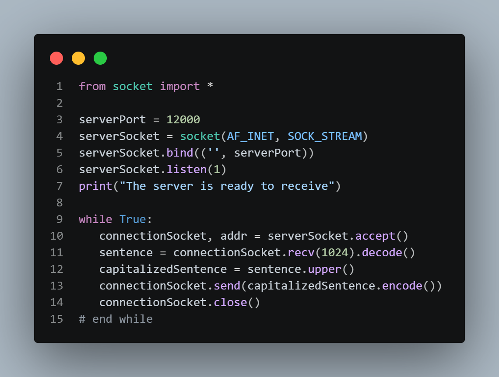
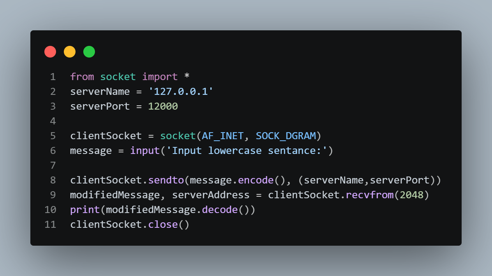
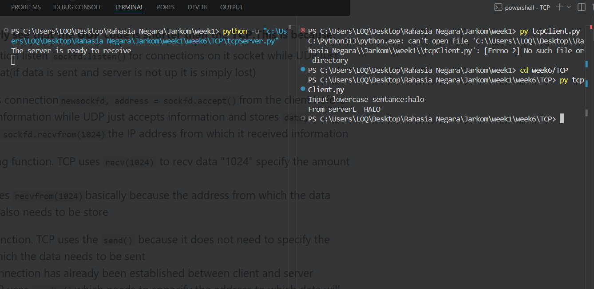
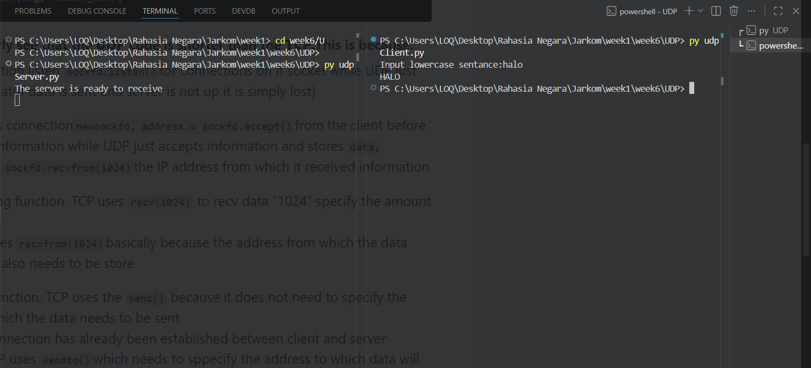

# Laporan Praktikum Jaringan Komputer (Week 6) 
# Socket Programing (TCP & UDP)
 

## Nama : Yoga Perkasa Didik
## Nim  : 103072400106
---

## Apa yang membedakan penggunaaan UDP dan TCP pada socket?

- Contoh Code server dengan UDP dan TCP
A. TCP

B. UDP

1. **TCP** menggunakan listen untuk menunggu, menampung (queue), dan mengelola permintaan koneksi dari client yang ingin terhubung ke server, sebelum koneksi tersebut benar-benar diterima menggunakan accept() sehingga server bisa berkomunikasi secara khusus dengan tiap client melalui koneksi yang terpisah. Sedangkan **UDP** tidak menggunakan listen karena tidak memiliki konsep koneksi.Server tidak perlu menunggu atau mengantre permintaan koneksi dari client, melainkan cukup menerima paket data yang dikirim secara langsung menggunakan read/recvfrom, di mana setiap paket yang datang juga membawa informasi alamat pengirim tanpa harus melalui proses accept() atau pembentukan koneksi terlebih dahulu. 

2. TCP menerima koneksi dari client sebelum bertukan informasi (**connectionSocket, addr = serverSocket.accept()**). Sedangkan UDP hanya menerima informasi dan langsung menyimpan data tersebut pada code (**message, clientAdress = serverSocket.recvfrom(2048)**) .

3. TCP menggunakan send() karena koneksi antara client dan server sudah terbentuk sehingga alamat tujuan tidak perlu ditentukan lagi, sedangkan UDP menggunakan sendto() karena tidak memiliki koneksi sehingga setiap pengiriman data harus menyertakan alamat tujuan secara eksplisit.

## Cara menggunakan UDP dan TCP di socket
1. Untuk TCP bisa menggunakan SOCK_STREAM dan untuk UDP bisa menggunakan SOCK_DGRAM.

2. Untuk TCP, pastikan untuk menggunakan listen dan accept karena sifatnya yang connection oriented, jadi memerlukan antrian per client sebelum komunkasi terjadi. UDP tidak perlu menggunakan listen dan accept karena dia tidak menggunakan konsep koneksi.

## Contoh Output Code
A. TCP

B. UDP
