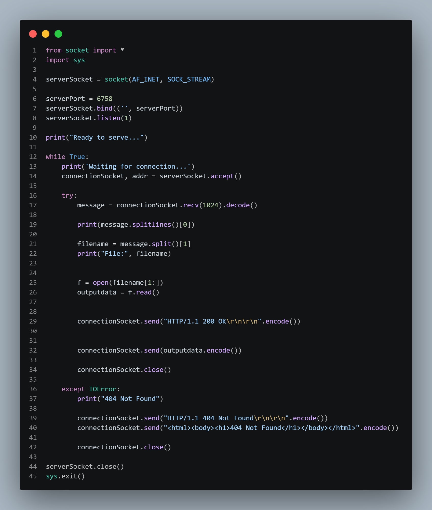
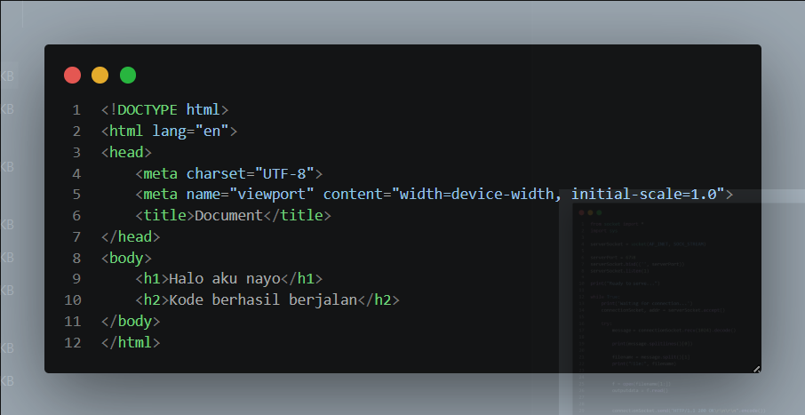
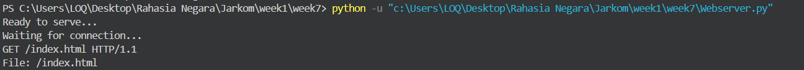
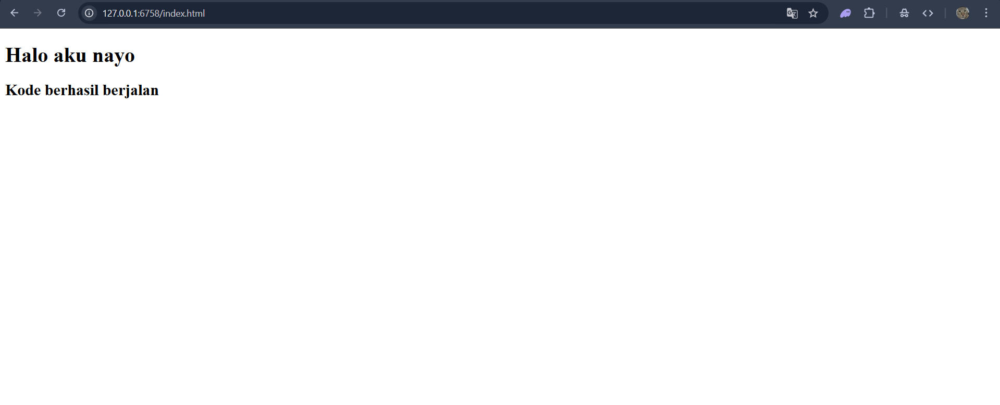

# Simple HTTP Web Server — Python

## Ringkasan

Program ini adalah **web server HTTP sederhana** yang dibuat menggunakan modul `socket` bawaan Python. Server ini menerima permintaan HTTP dari browser atau klien lain, lalu mengirimkan isi file yang diminta sebagai respons.

---

## Cara Kerja

### 1. Inisialisasi Socket
Server membuat socket TCP (`AF_INET`, `SOCK_STREAM`) dan mengikat (bind) ke port **6758**, lalu mulai mendengarkan koneksi masuk.

### 2. Menerima Koneksi
Server berjalan dalam loop `while True` — artinya terus berjalan selamanya. Setiap ada koneksi masuk dari klien, server menerimanya dengan `accept()`.

### 3. Membaca Request HTTP
Server membaca pesan dari klien (maksimal 1024 byte), lalu mengambil **nama file** dari baris pertama request HTTP.

Contoh request HTTP yang diterima:
```
GET /index.html HTTP/1.1
```
Server mengambil bagian `/index.html`, lalu membuka file `index.html` di direktori lokal.

### 4. Mengirim Respons
- **File ditemukan →** Server mengirim status `200 OK` beserta isi file.
- **File tidak ditemukan →** Server menangkap `IOError` dan mengirim status `404 Not Found` dengan halaman HTML sederhana.

### 5. Menutup Koneksi
Setiap koneksi ditutup setelah respons dikirim, lalu server kembali menunggu koneksi berikutnya.


---

## Komponen Utama

| Komponen | Fungsi |
|---|---|
| `socket(AF_INET, SOCK_STREAM)` | Membuat socket TCP/IP |
| `bind(('', 6758))` | Mengikat server ke port 6758 |
| `listen(1)` | Menunggu koneksi (maks. 1 antrian) |
| `accept()` | Menerima koneksi dari klien |
| `recv(1024)` | Membaca data request dari klien |
| `send()` | Mengirim respons HTTP ke klien |
| `IOError` | Menangani error jika file tidak ditemukan |

---

## Mengapa Menggunakan TCP?

HTTP bekerja di atas TCP, bukan UDP. Ini bukan kebetulan — ada alasan teknis yang kuat:

HTTP membutuhkan TCP karena:
- **Data harus utuh** — jika sebagian isi file hilang di tengah jalan, halaman web rusak.
- **Urutan harus benar** — byte pertama harus tiba sebelum byte terakhir.
- **Koneksi harus terbentuk dulu** — server perlu tahu klien siap sebelum mengirim data.

Itulah kenapa kode ini menggunakan `SOCK_STREAM` (TCP), bukan `SOCK_DGRAM` (UDP).

---

## Penjelasan Fungsi Socket Satu per Satu

### `socket(AF_INET, SOCK_STREAM)`
Membuat socket baru. `AF_INET` berarti menggunakan IPv4, dan `SOCK_STREAM` berarti protokolnya TCP. Kombinasi ini adalah standar untuk semua komunikasi HTTP.

### `bind(('', 6758))`
Mendaftarkan server ke port 6758 di mesin ini. String kosong `''` berarti server menerima koneksi dari **semua network interface** (bukan hanya localhost). Tanpa `bind`, OS tidak tahu port mana yang milik server ini.

### `listen(1)`
Memberitahu OS bahwa socket ini siap menerima koneksi masuk. Angka `1` adalah ukuran **backlog queue** — maksimal 1 koneksi yang boleh mengantri sambil menunggu diproses. Jika ada koneksi ke-2 datang saat server masih sibuk, koneksi itu ditolak.

### `accept()`
Fungsi ini **memblokir (blocking)** — program berhenti di sini dan menunggu sampai ada klien yang konek. Begitu ada klien, `accept()` mengembalikan dua nilai: `connectionSocket` (socket khusus untuk klien ini) dan `addr` (alamat IP klien). Setiap klien dapat socket-nya sendiri agar komunikasinya terpisah.

### `recv(1024)`
Membaca data yang dikirim klien, maksimal 1024 byte sekali baca. Untuk HTTP request yang panjang, ini bisa jadi masalah karena request bisa terpotong — tapi untuk keperluan demo ini cukup.

### `send()`
Mengirim data ke klien melalui koneksi TCP yang sudah terbentuk. Data dikirim sebagai bytes, makanya ada `.encode()` untuk mengubah string menjadi bytes.

### `close()`
Menutup koneksi TCP dengan klien — melakukan **TCP teardown** (FIN/ACK handshake). Penting untuk selalu menutup koneksi agar sumber daya OS dibebaskan.

---
## Keterbatasan

- Hanya melayani **satu koneksi dalam satu waktu** (tidak concurrent).
- Tidak mendukung tipe konten (MIME type) — semua file dikirim sebagai teks biasa.
- Tidak ada validasi keamanan — rentan terhadap *path traversal attack*.
- Header HTTP yang dikirim sangat minimal.

## Screenshoot
A. Webserver.py

B. Index.html

C. Run testing + Web

