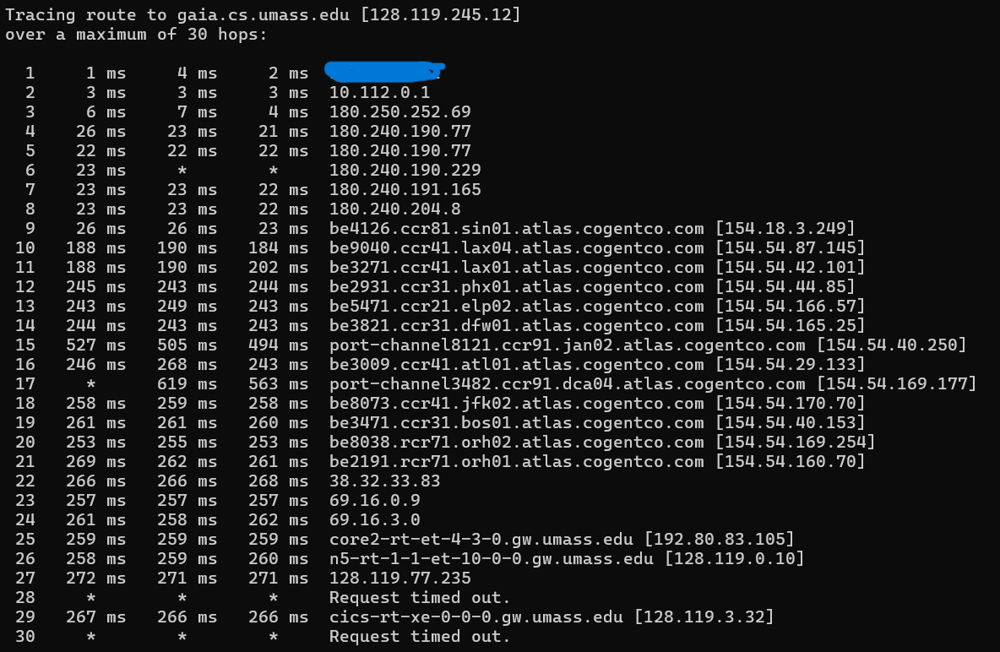
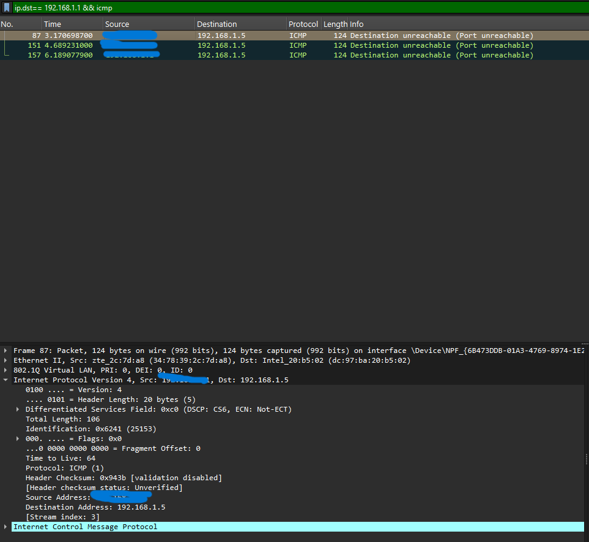
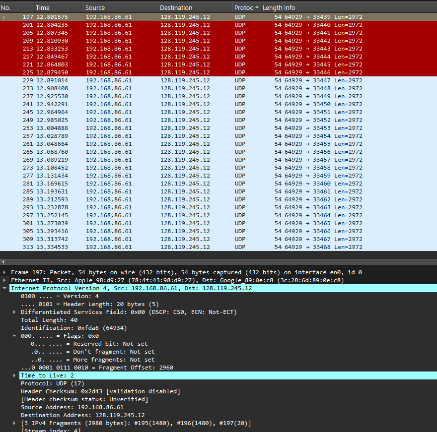
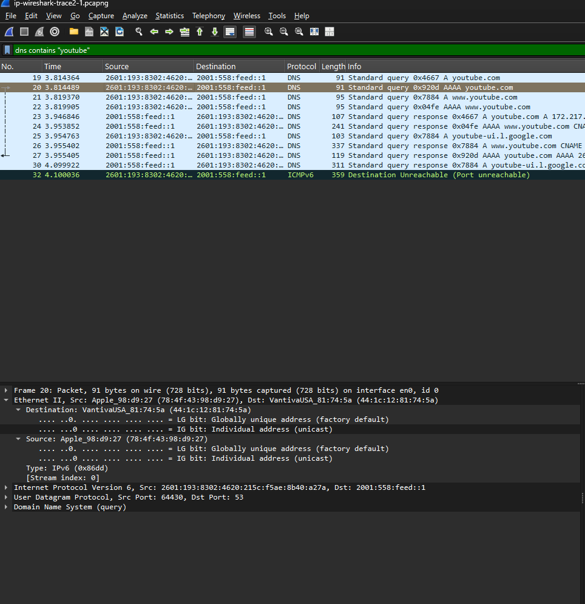

# Laporan Praktikum Jaringan Komputer (Week 6) 
# Socket Programing (IPv4 & IPv6)
 

## Nama : Yoga Perkasa Didik
## Nim  : 103072400106
---

### IPv4
- Melakukan pelacakan route yang dilewati oleh komputer hingga sampai ke server gaia.cs.umass.edu
- melalui command `tracert gaia.cs.umass.edu`
- 
- Dapat dilihat jika komputer melewati router rumah (gateway) di 192.******* (bagian sensor biru) lalu menjuju ISP sebelum masuk ke jaringan internasional, sebelum pada akhirnya sampai di server Umsass.

A. IPv4 Dasar 
>Traceroute & TTL pada ip lokal dengan target menuju umass.
- 
- Nilai TTL 64 dapat disebabkan oleh TTL Exceeded atau TTL sudah habis sebelum sampai tujuan hingga router harus membuat paket baru dengan stok TTL yang baru.
- Pesan `Destination Unreachable (port unreachable)` dari yang saya baca di forum, sama seperti model TCP `Connection Refused`, tapi karena UDP maka informasinya seperti yang tadi. Pesan itu aman kok selama website masih bisa dimasuki.

> **Mencari fragmentasi kiriman traceroute**
>, menggunakan nama file yang sama dengan di modul!!.

- 
- Dapat dilihat jika terdapat banyak sekali paket UDP yang dikirimkan menuju alamat tujuan dengan ukuran sekitar 2972 byte. Hal ini terjadi karena program traceroute mengirimkan beberapa probe untuk setiap nilai TTL yang berbeda. Setiap paket UDP tersebut merupakan datagram besar yang kemudian mengalami fragmentasi pada lapisan IP. Fragmentasi ini terlihat dari adanya beberapa bagian paket dengan nilai fragment offset yang berbeda serta informasi bahwa satu datagram dipecah menjadi beberapa fragment. Dengan demikian, banyaknya paket UDP yang terlihat bukan merupakan hasil fragmentasi langsung, melainkan banyaknya datagram yang dikirim, di mana masing-masing datagram tersebut kemudian dipecah menjadi beberapa fragment yang lebih kecil.

> TTL pada setiap paket mulai dari 197-313 mengalami kenaikan
- Hal ini karena program traceroute mengirimkan paket secara bertahap dengan nilai TTL yang semakin besar untuk setiap percobaan. Nilai TTL ini digunakan untuk menentukan sejauh mana paket dapat menjangkau router di jaringan. Setiap kali TTL bertambah, paket dapat melewati satu hop tambahan sebelum akhirnya habis dan memicu balasan ICMP Time Exceeded dari router berikutnya. 

B. IPv6
> Memahami bagaimana protokol IPv6 dalam komunikasi jaringan, khususnya proses DNS menggunakan query tipe AAAA untuk mendapatkan alamat IPv6 seperti Youtube.com.

- 
- AAAA sendiri adalah jenis record spesifik untuk IPv6 yang digunakan untuk memetakan nama domain ke alamat IPv6. Pada kasus ini, query AAAA digunakan untuk mendapatkan alamat IPv6 dari YouTube sehingga komunikasi dapat dilakukan melalui jaringan IPv6.
